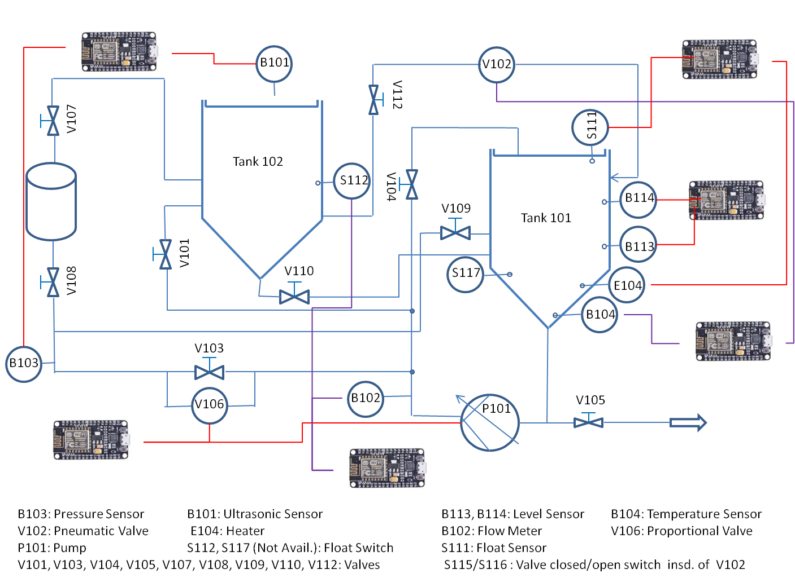

# FESTO Water Management Workstation

This data set includes six Thing Descriptions (TDs),
as [defined by the W3C Web of Things working group](https://www.w3.org/TR/wot-thing-description/),
hosted on NodeMCU micro-controllers. These micro-controllers
are wired to various devices to control a
[water management workstation](http://www.festo-didactic.com/int-en/learning-systems/environmental-automation/water-management/hardware/water-supply-station-to-the-very-last-drop-....htm)
designed for educational purposes by FESTO.

## WoT semantic discovery experiments

We formulated the problem of WoT semantic discovery
as an abduction reasoning task.

 - assertions with fresh individuals created during reasoning
   for each micro-controller are in the folder [`/fresh`](fresh)
 - update ABoxes to send to each micro-controller after reasoning
   are in the folder [`/update`](update)

